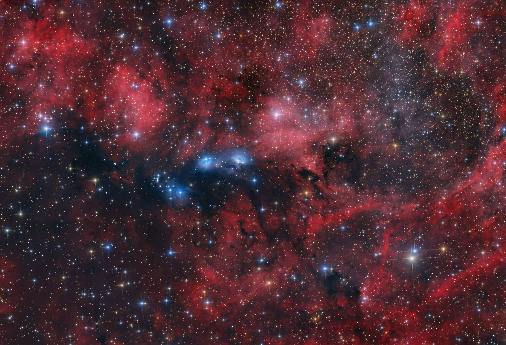

# NASA Satellite Dashboard (Demo)

This project is my journey into **space data & networking** 🚀  

### ✅ Current Features
- `scripts/fetch_sample_data.py`: Fetches NASA Astronomy Picture of the Day (APOD) metadata using NASA’s public API.
- Stores JSON output in the `data/` folder.

## 🌌 Sample Visualization

NASA Astronomy Picture of the Day (APOD):

## 🚀 ISS Tracker

This project now includes a script that fetches the **real-time position of the International Space Station (ISS)** using the [Open Notify API](http://api.open-notify.org/).

- Data is stored in [`data/iss_positions.csv`](data/iss_positions.csv).
- Each run of [`scripts/iss_tracker.py`](scripts/iss_tracker.py) appends a new row with timestamp, latitude, and longitude.
- Example rows:

| fetched_at (UTC)          | timestamp   | latitude | longitude |
|----------------------------|-------------|----------|-----------|
| 2025-09-30T12:34:56Z | 1717101234 | 23.45    | 67.89     |
| 2025-09-30T12:35:12Z | 1717101249 | 23.52    | 68.02     |

Next step: visualize ISS path on a world map 🌍

### 📅 Roadmap
- Add more NASA datasets (Earth observation, satellites).
- Process and visualize data.
- Build a simple dashboard for space missions.

---

👩‍💻 Built while learning **AWS + Space Data Networking**  
🌐 Member of [Interplanetary Networking SIG (IPNSIG)](https://ipnsig.org)
